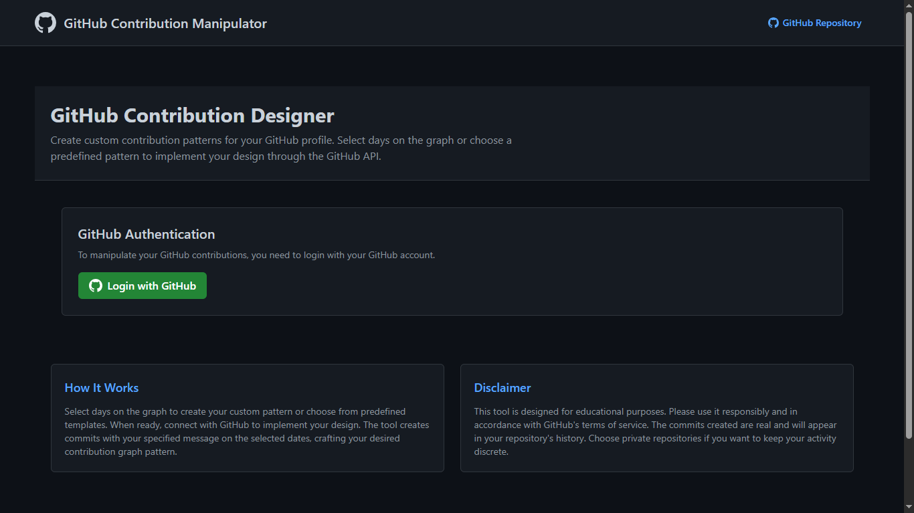
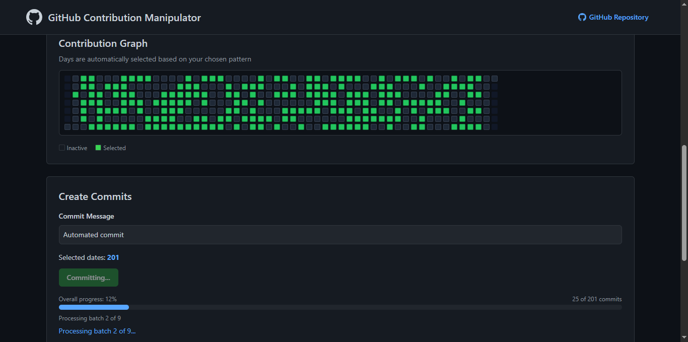

# GitHub Contribution Manipulator

## 🚀 [Try it Live](https://github-contribution-manipulator.vercel.app/)⬅

A visual tool that allows you to design custom GitHub contribution patterns and implement them through the GitHub API.

[English](#english) | [Bahasa Indonesia](#bahasa-indonesia)

## English

### 📌 About This Project

GitHub Contribution Designer is a web application that lets you visually create and implement custom GitHub contribution patterns. Whether you want to maintain a perfect streak, highlight weekends, or create artistic designs in your contribution graph, this tool makes it simple with both visual editing and predefined templates.

### 🌟 Features

- **Visual Designer**: Create patterns by clicking directly on a GitHub-style contribution graph
- **Pattern Templates**: Choose from predefined patterns like daily streaks, weekends only, or random distributions
- **Repository Management**: Select which of your repositories to use for contributions
- **Custom Messages**: Set your own commit messages
- **Date Range Control**: Specify exact date ranges for your contribution patterns
- **User-Friendly Interface**: Responsive design works on any device

### 💻 How It Works

The tool uses GitHub's API to create commits with custom timestamps. When you select days on the contribution graph and click "Create Commits", the application makes real commits to your selected repository with timestamps matching your selected dates.

### 📝 Usage

1. Visit the [live application](https://github-contribution-manipulator.vercel.app/)
2. Log in with your GitHub account
3. Select a repository from your account
4. Design your contribution pattern using the visual interface
5. Enter a custom commit message
6. Click "Create Commits via GitHub API"

### 🛡️ Privacy & Security

- The application requires GitHub authentication to make commits on your behalf
- Only repositories you explicitly select will be modified
- No personal data is stored beyond what's needed for the application to function
- Your GitHub credentials are never stored

### ⚠️ Ethical Usage Notice

This tool is designed for educational purposes to demonstrate how GitHub's contribution system works. Please use it responsibly and in accordance with GitHub's terms of service.

## Bahasa Indonesia

### 📌 Tentang Proyek

GitHub Contribution Designer adalah aplikasi web yang memungkinkan Anda membuat dan mengimplementasikan pola kontribusi GitHub kustom secara visual. Baik Anda ingin mempertahankan streak sempurna, menonjolkan akhir pekan, atau membuat desain artistik di grafik kontribusi Anda, alat ini membuatnya sederhana dengan pengeditan visual dan template yang telah ditentukan.

### 🌟 Fitur

- **Desainer Visual**: Buat pola dengan mengklik langsung pada grafik kontribusi bergaya GitHub
- **Template Pola**: Pilih dari pola yang telah ditentukan seperti streak harian, hanya akhir pekan, atau distribusi acak
- **Manajemen Repositori**: Pilih repositori mana dari akun Anda yang akan digunakan untuk kontribusi
- **Pesan Kustom**: Atur pesan commit Anda sendiri
- **Kontrol Rentang Tanggal**: Tentukan rentang tanggal yang tepat untuk pola kontribusi Anda
- **Antarmuka Ramah Pengguna**: Desain responsif berfungsi di perangkat apa pun

### 💻 Cara Kerja

Alat ini menggunakan API GitHub untuk membuat commit dengan timestamp kustom. Ketika Anda memilih hari di grafik kontribusi dan mengklik "Create Commits", aplikasi membuat commit nyata ke repositori yang Anda pilih dengan timestamp yang sesuai dengan tanggal yang Anda pilih.

### 📝 Penggunaan

1. Kunjungi [aplikasi langsung](https://github-contribution-manipulator.vercel.app/)
2. Masuk dengan akun GitHub Anda
3. Pilih repositori dari akun Anda
4. Desain pola kontribusi Anda menggunakan antarmuka visual
5. Masukkan pesan commit kustom
6. Klik "Create Commits via GitHub API"

### 🛡️ Privasi & Keamanan

- Aplikasi memerlukan autentikasi GitHub untuk membuat commit atas nama Anda
- Hanya repositori yang Anda pilih secara eksplisit yang akan dimodifikasi
- Tidak ada data pribadi yang disimpan selain yang diperlukan agar aplikasi berfungsi
- Kredensial GitHub Anda tidak pernah disimpan

### ⚠️ Pemberitahuan Penggunaan Etis

Alat ini dirancang untuk tujuan pendidikan untuk mendemonstrasikan bagaimana sistem kontribusi GitHub bekerja. Harap gunakan secara bertanggung jawab dan sesuai dengan ketentuan layanan GitHub.

---

## 📷 Preview

## 👨‍💻 Author

Created by [Muhammad Faiz Hidayat](https://github.com/Faiz-Hidayat)

---

*Note: This repository contains only information about GitHub Contribution Designer. The actual application is hosted on Vercel.*
